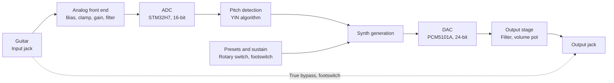

# Guitar Synthesizer

A monophonic guitar synthesizer pedal based on a custom PCB featuring an STM32H7, analog input conditioning, real-time pitch detection in firmware, and digital synthesizer driving an external DAC.

Development boards for the latest revision (3.3) were sponsored by [PCBWay](https://www.pcbway.com). Their quality has been great, and I go deeper into this in the [Acknowledgements](#acknowledgements) section below.

This repo is a work in progress. More detail, source files and demo videos will be added as the project progresses.

## What the pedal does

The pedal takes an electric guitar signal in, filters and biases it, and feeds it to an STM32H7VET6 microcontroller. The MCU detects the pitch in under 20ms, and uses that to generate a synth note, which outputs through an external 24-bit DAC (PCM5101A). There is a footswitch for true bypass and a footswitch for a sustain mode. A volume pot sets the level of the synth output, and a 12-position rotary switch selects synth presets.

*Rev 3.3 PCB, with buffer repair and assembled without the enclosure*

## Signal chain

**Guitar input**
A 1/4" / 6.35mm mono jack receives the guitar signal. In bypass mode (activated by the bypass footswitch), this signal is routed straight to the output jack.

**Analog front end**
The guitar signal is AC coupled and biased to 1.65V (which is the midpoint between the STM32 ADC's min/max input). Clamping diodes are used to keep the input signal between the 0-3.3V range to protect the ADCs from ESD and overvoltage.
The signal then enters a gain stage, with gain being adjustable using a trimmer potentiometer (ranging from 1x to 7.7x gain).
After the gain stage, the signal passes through a 4th-order low-pass Butterworth filter in Sallen-Key topology. This filter is in a unity gain configuration has a -3dB cutoff of 12kHz relative to the passband gain.

**ADC**
The STM32H7's 16-bit ADC is used to sample the filtered signal, with 4x oversampling used to sample at 192kHz. The effective number of bits from the ADC are more than enough for the YIN pitch detection algorithm to work reliably, which is why an external ADC was not used.

**Pitch detection**
