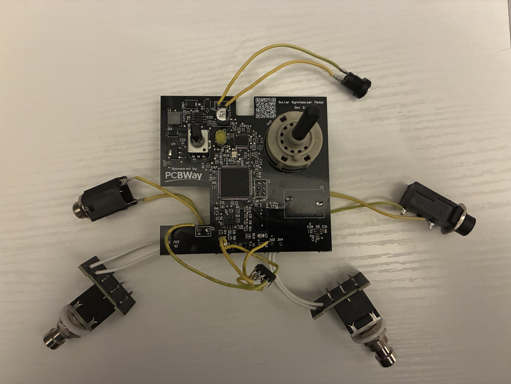
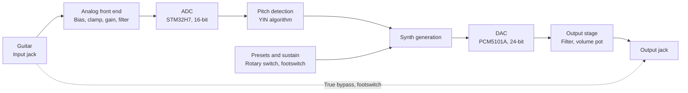

# Guitar Synthesizer

A monophonic guitar synthesizer pedal based on a custom PCB featuring an STM32H7, analog input conditioning, real-time pitch detection in firmware, and digital synthesizer driving an external DAC.

This repo is a work in progress. More detail, source files and demo videos will be added as the project progresses.

## Acknowledgements

This board was sponsored by [PCBWay](https://www.pcbway.com). PCBWay has been great to work with, and their board quality and customer service is excellent. Their engineers also caught a mistake on my board where the pad spacing on the analog IC switch footprint was below their fabrication tolerance, and gave me the chance to fix it before the board was fabricated.

I am very thankful that PCBWay has supported this project, and I highly recommend their services to anyone who is thinking about making their own PCB.

## What the pedal does

The pedal takes an electric guitar signal in, filters and biases it, and feeds it to an STM32H7VET6 microcontroller. The MCU detects the pitch in under 20ms, and uses that to generate a synth note, which outputs through an external 24-bit DAC (PCM5101A). There is a footswitch for true bypass and a footswitch for a sustain mode. A volume pot sets the level of the synth output, and a 12-position rotary switch selects synth presets.

*Rev 3.3 PCB, with buffer repair and assembled without the enclosure*

## Signal chain

#### Guitar input
A 1/4" / 6.35mm mono jack receives the guitar signal. In bypass mode (activated by the bypass footswitch), this signal is routed straight to the output jack.

#### Analog front end
The guitar signal is AC coupled and biased to 1.65V (which is the midpoint between the STM32 ADC's min/max input). Clamping diodes are used to keep the input signal between the 0-3.3V range to protect the ADCs from ESD and overvoltage.
The signal then enters a gain stage, with gain being adjustable using a trimmer potentiometer (ranging from 1x to 7.7x gain).
After the gain stage, the signal passes through a 4th-order low-pass Butterworth filter in Sallen-Key topology. This filter is in a unity gain configuration has a -3dB cutoff of 12kHz relative to the passband gain.

#### ADC
The STM32H7's 16-bit ADC is used to sample the filtered signal, with 4x oversampling used to sample at 192kHz. The effective number of bits from the ADC are more than enough for the YIN pitch detection algorithm to work reliably, which is why an external ADC was not used.

#### Pitch detection
The YIN pitch detection algorithm is used to estimate pitch with less than 20ms of latency. This is a time domain pitch detection algorithm and can only extract single frequencies, so polyphonic pitch detection is not possible yet without a hexaphonic pickup.

#### Synth generation
The STM32H7 generates the waveforms for synthesizer output based on the detected pitch. This means the raw guitar signal has no effect on the output, aside from its pitch.

#### DAC
The synth generator's output goes to an external PCM5101A. This DAC is 24-bit and was chosen over the STM32H7's internal 12-bit DAC due to audio quality concerns.

#### Presets and sustain
A 12-position rotary switch is used to choose synth presets, with each throw of the switch mapped to a GPIO pin. A second footswitch is used to activate a sustain mode.

## Hardware revision history
| Revision | Changes |
|---|---|
| 1 | First board designed, did not get fabricated |
| 2 | <ul><li>Added the 4th-order Butterworth anti-aliasing filter (Rev 1 had no filtering)</li><li>Fixed the direction of the reverse current protection diodes across the LDOs</li><li>Removed the 5V LDO before the 3.3V LDO as I incorrectly calculated current draw to be low enough to not harm the 3.3V LDO</li><li>Replaced TL071 op amps with the OPA340, as the TL071 isn't rail-to-rail which limited my guitar input range</li></ul> |
| 3.3 (PCBWay sponsored) | <ul><li>Integrated the STM32H7VET6 onto the board instead of using header pins to interface with a separate Nucleo board</li><li>Added an external DAC (PCM5101A)</li><li>Added a 4x gain stage on the guitar input before the ADC</li><li>Added a 5V buck and a TVS diode before the 3.3V LDO to reduce heat generated by the 3.3V LDO and protect against ESD</li><li>Added clamping diodes on guitar input to keep signal between 0 and 3.3V</li><li>Replaced resistor ladder that was used for preset selection with individual GPIO pins for each rotary switch position</li><li>Added a second footswitch for the sustain mode</li></ul> |
| 4 (upcoming) | <ul><li>Fixed -100% solder mask expansion on DAC footprint which caused all DAC pins to be covered</li><li>Made low pass Butterworth filter unity gain</li><li>Added buffering/gain stage before the filter to fix unexpected filter response from high impedance signal and allow for adjustment of gain</li><li>Fixed PCB corners clipping the inner corners of the enclosure</li><li>Replaced 5V buck with 5V LDO before the 3.3V LDO to reduce switching noise</li><li>Added test points for 5V, 3.3V, GND, SWDIO, SWCLK, SWO, biased input, pedal input and filtered guitar signal</li><li>Added pulldown resistor to analog IC switch's enable pin</li><li>Replaced 0603 bulk capacitors with larger sizes for higher voltage rating to reduce derating effects</li><li>Added indicator LEDs for power</li><li>Added thermal reliefs for ground pads within ground pours, which were previously acting as heat sinks</li><li>Added STLINK connector to board to replace programming with Nucleo board and header pins, which was unreliable at higher speeds</li></ul> |

